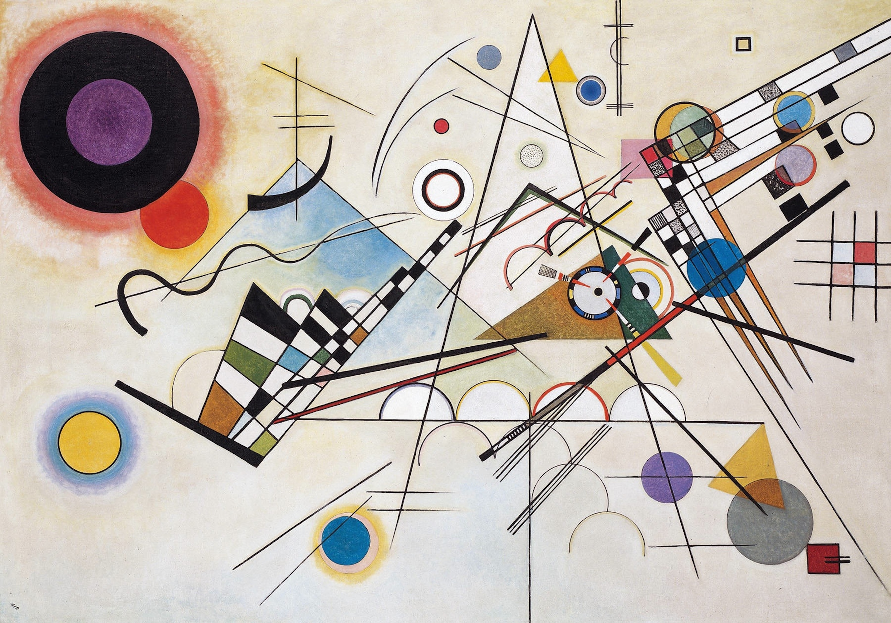

# Kandinsky Composition VIII – Interactive Reinterpretation

## Inspiration

Our project is inspired by **Wassily Kandinsky's Composition VIII (1923)**.

Kandinsky's work uses geometric shapes, circles, lines, arcs, and colour relationships to create rhythm and balance within a static composition. We were interested in exploring how these visual elements could become interactive through code.

Instead of reproducing the artwork exactly, we reinterpret it as a dynamic digital experience. Through animation, sound, randomness, and user interaction, the composition gradually changes over time while still preserving the visual language and structure of the original artwork.

### Original Artwork

### Additional Inspiration

- Kandinsky's use of geometric abstraction
- Motion graphics and generative art
- Interactive p5.js artworks
- Audio-reactive visualisations

---

# Techniques

This project was developed using **p5.js** and combines four mechanics into one interactive artwork.

### Key Techniques Used

- `frameCount()` for time-based animation
- `lerp()` for smooth line growth and transitions
- `sin()` for cyclical motion and pulsing effects
- `noise()` (Perlin Noise) for smooth organic movement
- `random()` and `randomSeed()` for controlled randomness
- `p5.FFT()` for audio frequency analysis
- `mousePressed()`, `mouseDragged()` and keyboard input
- `push()`, `pop()`, `translate()` and `rotate()` for geometric transformations

### Team Design Decisions

Our team decided to maintain the recognisable structure of Kandinsky's Composition VIII while introducing movement and interaction.

Instead of dramatically altering the artwork, we focused on making the geometric elements feel alive through gradual animation, sound response, randomness, and user participation.

---

# Mechanic Ownership

## Time-Based Mechanic – Wanni Xiang

The time mechanic gradually builds the composition over time using `frameCount()`.

Lines appear progressively using `lerp()`, geometric elements rotate using `rotate()`, and subtle motion is created through `sin()` and `noise()`. A low-saturation colour palette was used to maintain a vintage Kandinsky-inspired appearance.

The purpose of this mechanic is to create a sense of growth and development, allowing the composition to slowly reveal itself rather than appearing all at once.

---

### References

- p5.js noise() Reference
  https://p5js.org/reference/p5/noise/

- p5.js lerp() Reference
  https://p5js.org/reference/p5/lerp/

- p5.js map() Reference
  https://p5js.org/reference/p5/map/

- p5.js rotate() Reference
  https://p5js.org/reference/p5/rotate/

- p5.js push() / pop() Reference
  https://p5js.org/reference/p5/push/
  https://p5js.org/reference/p5/pop/
  
- Kandinsky, W. (1923). Composition VIII.
  Inspiration for geometric composition, line arrangements, circles and arc structures.

---

# AI Acknowledgement

This project used **ChatGPT** to assist with:

- Understanding p5.js functions and syntax
- Debugging code
- Improving code structure and modularity
- Writing comments and documentation
- Refining animation techniques

All AI-generated suggestions were reviewed, modified, and integrated by team members before implementation.

---

## Perlin Noise Documentation: Zihan Jiang

For the Perlin Noise and Randomness mechanic, I focused on preserving the composition of Kandinsky’s Composition VIII while introducing subtle generative behaviour. I replaced the uneven chessboard-like blocks in the original artwork with colourful vertical strips that move up and down randomly, somewhat like piano keys. The central circle uses a layered gradient and a breathing vibration effect, with both the amplitude and the colours driven randomly. Segmented rotating pointers are composed of small colour blocks with varying widths, creating a visual rhythm that echoes the surrounding grid elements while rotating around the circle. Perlin Noise controls the smooth motion of the strips, the centre circle, the outer rings, and the pointer lengths, producing continuous and organic animation. A translucent asymmetrical triangle was also added behind the circle to enhance depth while maintaining the geometric structure and overall balance.

### References
- [Refik Anadol Studio](https://dataland.art/blog/qualia)
- [teamlab Interactive Environment](https://www.teamlab.art/e/living_digital_space/)
- [p5.js noise() Reference](https://p5js.org/reference/p5/noise/)
- [p5.js random() Reference](https://p5js.org/reference/p5/random/)
- [p5.js lerpColor() Reference](https://p5js.org/reference/p5/lerpColor/)
- Original artwork: *Composition VIII* (1923) by Wassily Kandinsky

# AI Acknowledgement
- Used ChatGPT to enhance the English sentences and correct the spelling errors.
- Used ChatGPT to define the position of all graphics.
- Used ChatGPT to define the colour palette.

---

## Audio: Yixin Liu
This audio interactive module actualizes Wassily Kandinsky's synesthetic theory that geometric shapes and colors possess inherent sonic characteristics, reanimating his static work *Composition VIII* into a sound-responsive animated piece.

Developed with the `p5.sound` library, this system uses **p5.FFT frequency analysis** and amplitude detection to parse real-time audio data. The original classical piano audio file downloaded from Tunetank is renamed to `music.mp3` for simplified file referencing, which is loaded and read by the program. Audio signals are split into bass, midrange, and treble frequency bands, each mapped to exclusive circular visual elements on the canvas:
1. The prominent large circle in the upper-left corner (black outer body, purple inner circle, diffused red outer glow) reacts to bass frequency energy and overall volume. Its diameter expands and contracts with bass intensity, while the range and opacity of the red outer halo strengthen alongside rising bass power.
2. Five segmented colorful annular rings distributed across the canvas are assigned to different frequency ranges:
   - Red-orange segmented circle responds to bass frequencies
   - Yellow and pale light-blue segmented circles are driven by mid-range audio energy
   - Blue and grey-toned segmented circles follow treble frequency changes
The ring width, color saturation and brightness of each segmented circle dynamically scale up and down based on the energy level of its corresponding frequency band.

Users can press the **Spacebar** to play or pause the piano audio track to manually control the whole visual rhythm. When the piano melody is loud and energetic, all circular shapes swell in size with highly saturated bright colors; during soft, quiet passages of the piano piece, elements shrink and colors fade gently, letting the entire abstract composition breathe and flow synchronously with the cadence of classical piano music.

### References

- [p5.FFT Official Documentation](https://p5js.org/reference/p5.sound/p5.FFT/)
- [p5.sound Full Library Reference](https://p5js.org/reference/p5.sound/p5.sound/)
- [p5.Amplitude Reference](https://p5js.org/reference/p5.sound/p5.Amplitude/)
- Kandinsky's synesthesia and art theory: [Wassily Kandinsky - Music and Colour](https://www.wassilykandinsky.net/music.php)
- Original Artwork Reference: *Composition VIII*, 1923, Wassily Kandinsky
- Audio Source: Classical piano track originally named `tunetank-piano-classical-music-347514` from Tunetank, renamed locally to `music.mp3` for project use

---

## User Input Mechanic Ruiqi Xu

My contribution was inspired by interactive digital artworks that encourage audience participation rather than passive viewing. I wanted users to feel connected to the visual composition through simple actions such as moving, clicking, and dragging the mouse.

The visual style of the interaction effects was influenced by the project's Kandinsky-inspired composition. I selected colours and motion behaviours that complement the geometric forms and audio-reactive elements already present in the artwork.

### References

- [p5.js mouseX Reference](https://p5js.org/reference/p5/mouseX/) — Official p5.js documentation for tracking the mouse’s horizontal position.
- [p5.js mouseY Reference](https://p5js.org/reference/p5/mouseY/) — Official p5.js documentation for tracking the mouse’s vertical position.
- [p5.js mousePressed() Reference](https://p5js.org/reference/p5/mousePressed/) — Official p5.js documentation for detecting mouse clicks.
- [p5.js keyPressed() Reference](https://p5js.org/reference/p5/keyPressed/) — Official p5.js documentation for detecting keyboard input.

---

# Interaction Instructions

## How to Experience the Work

1. Open the project in a web browser.
2. Press the Space bar to start the audio.
3. Watch the composition gradually develop over time.
4. Move the mouse around the screen to generate particle trails.
5. Click anywhere on the canvas to create ripple effects.
6. Click and drag any audio-reactive circle to reposition it.
7. Observe how the circles continue responding to music while being moved.
8. Experiment with different arrangements and movements to create unique visual outcomes.

Because the project uses randomness and Perlin Noise, every experience will be slightly different.

### The goal of this mechanic is to transform the viewer into an active participant who can directly influence the visual composition.
---

# Team Members

| Team Member | Mechanic |

| Yixin Liu | Audio |

| Wanni Xiang | Time-based |

| Zihan Jiang | Perlin noise and randomness |

| Ruiqi Xu | User input |
